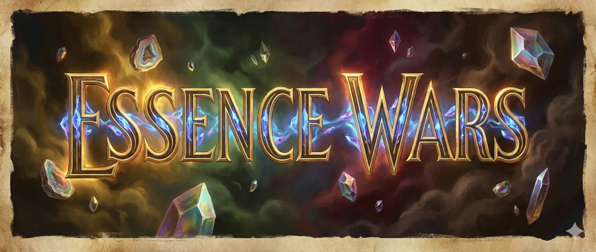

<p align="center">
  
</p>

<p align="center">
  <strong>A deterministic, perfect-information strategy card game designed for AI research</strong>
</p>

<p align="center">
  <a href="#quick-start">Quick Start</a> •
  <a href="#features">Features</a> •
  <a href="#project-structure">Project Structure</a> •
  <a href="#documentation">Documentation</a> •
  <a href="#contributing">Contributing</a>
</p>

---

## What is Essence Wars?

Essence Wars is a strategic two-player card game engine with a focus on:

- **Perfect Information** — Both players see all cards, including hands and decks. Victory comes from outthinking your opponent, not luck.
- **Deterministic Execution** — Seeded RNG ensures every game is reproducible, perfect for AI training and analysis.
- **Lane-Based Combat** — Creatures occupy board positions, creating spatial strategy alongside card selection.
- **ML-Ready Design** — 328-float state tensors, 256 discrete actions, and high-performance Rust engine (~33k games/sec).

<p align="center">
  
</p>

## Features

### Desktop Application
Full-featured Tauri desktop client with Human vs AI, Spectator mode, Replays, Deck Builder, and Tutorial.

<p align="center">
  
  
  
</p>

### AI & Machine Learning
- **Multiple Bot Types** — Random, Greedy (28 tunable weights), MCTS, Alpha-Beta search
- **Python ML Framework** — Gymnasium/PettingZoo environments, PPO, AlphaZero, Card2Vec
- **Training Infrastructure** — Callbacks, experiment tracking, Elo ratings, HTML reports

### Claude Code Integration
Play Essence Wars directly in Claude Code via MCP (Model Context Protocol):
- Natural language game control
- AI move recommendations with analysis
- Live game visualization in Tauri UI

## Quick Start

### Play the Desktop App

```bash
# Clone and build
git clone https://github.com/christianwissmann85/essence-wars
cd essence-wars
cargo build --release

# Launch the UI
cd crates/essence-wars-ui
pnpm install && pnpm tauri:dev
```

### Train ML Agents (Python)

```bash
# Install Python package
pip install essence-wars[train]

# Train a PPO agent
essence-wars train ppo --timesteps 500000

# Benchmark against baselines
essence-wars benchmark --checkpoint model.pt
```

### Play via Claude Code (MCP)

Add to your `.mcp.json`:

```json
{
  "mcpServers": {
    "essence-wars": {
      "command": "./target/release/essence-wars-mcp"
    }
  }
}
```

Then in Claude Code: *"Start a game with the Iron Wall deck against Swarm Aggro"*

## Project Structure

```
essence-wars/
├── crates/
│   ├── cardgame/           # Core game engine (Rust)
│   ├── essence-wars-ui/    # Desktop app (Tauri + Svelte)
│   └── essence-wars-mcp/   # MCP server for Claude Code
├── python/                 # ML agents & training (PyTorch)
├── data/
│   ├── cards/              # Card definitions (YAML)
│   ├── decks/              # Deck definitions (TOML)
│   └── weights/            # Bot weight files
└── docs/                   # Documentation
```

| Component | Description | README |
|-----------|-------------|--------|
| **cardgame** | High-performance game engine, bots, CLI tools | [README](crates/cardgame/README.md) |
| **essence-wars-ui** | Cross-platform desktop client | [README](crates/essence-wars-ui/README.md) |
| **essence-wars-mcp** | MCP server for Claude Code | [README](crates/essence-wars-mcp/README.md) |
| **python** | ML agents, training, benchmarking | [README](python/README.md) |

## Three Factions

| Faction | Identity | Keywords |
|---------|----------|----------|
| **Argentum Combine** | Defense & durability | Guard, Shield, Fortify, Piercing |
| **Symbiote Circles** | Aggressive tempo | Rush, Lethal, Regenerate, Volatile |
| **Obsidion Syndicate** | Burst damage | Lifesteal, Stealth, Quick, Charge |

Plus **Neutral** cards and **12 unique Commanders** with passive abilities.

## Documentation

### Game Design
- [Game Rules](docs/game-design/rules.md) — Complete rules, keywords, card types
- [Lore & World](docs/game-design/lore.md) — Faction history and characters

### Art & Assets
- [Style Guide](docs/art/style-guide.md) — Visual design guidelines
- [Asset Generation](docs/art/asset-generation.md) — AI-assisted art pipeline

### ML & AI
- [Bot System](docs/ml-infrastructure/bots.md) — Bot architecture, weight tuning
- [Training Pipeline](docs/ml-infrastructure/training.md) — PPO, AlphaZero, behavioral cloning
- [Ratings System](docs/ml-infrastructure/ratings.md) — Elo tracking for decks and agents

### Development
- [CLI Reference](docs/development/cli.md) — Command-line tools
- [Reporting](docs/development/reporting.md) — Analysis and visualization

## Performance

| Metric | Value |
|--------|-------|
| Random games | ~33,000/sec |
| Greedy bot games | ~4,300/sec |
| MCTS (100 sims) | ~22ms/move |
| Engine state clone | ~245 ns |
| State tensor encode | ~158 ns |

## Commands

```bash
# Build & Test
cargo build --release                    # Full workspace
cargo nextest run --status-level=fail    # Rust tests
uv run pytest python/tests               # Python tests

# Lint
cargo lint                               # Rust (clippy)
uv run mypy python/essence_wars          # Python types
pnpm run check                           # Svelte/TS (in UI crate)

# Game Tools
cargo run --release --bin arena --       # Bot matches
cargo run --release --bin validate --    # Quick balance check
cargo run --release --bin benchmark --   # Thorough analysis
cargo run --release --bin swiss --       # Tournament mode
```

## Contributing

Contributions are welcome! This project uses:

- **Rust** for the core engine and desktop backend
- **Svelte 5** (with runes) for the desktop frontend
- **Python** for ML agents and training

Each crate has its own `CLAUDE.md` with AI-developer context and `README.md` with human contributor documentation.

### Development Setup

```bash
# Rust
cargo build --release

# Python (using uv)
uv sync --all-groups
uv run pytest python/tests

# UI (using pnpm)
cd crates/essence-wars-ui
pnpm install
pnpm tauri:dev
```

## License

MIT License — see [LICENSE](LICENSE) for details.

---

<p align="center">
  <strong>Built with Rust, Svelte, and PyTorch</strong><br>
  <em>Designed for humans and AIs alike</em>
</p>
