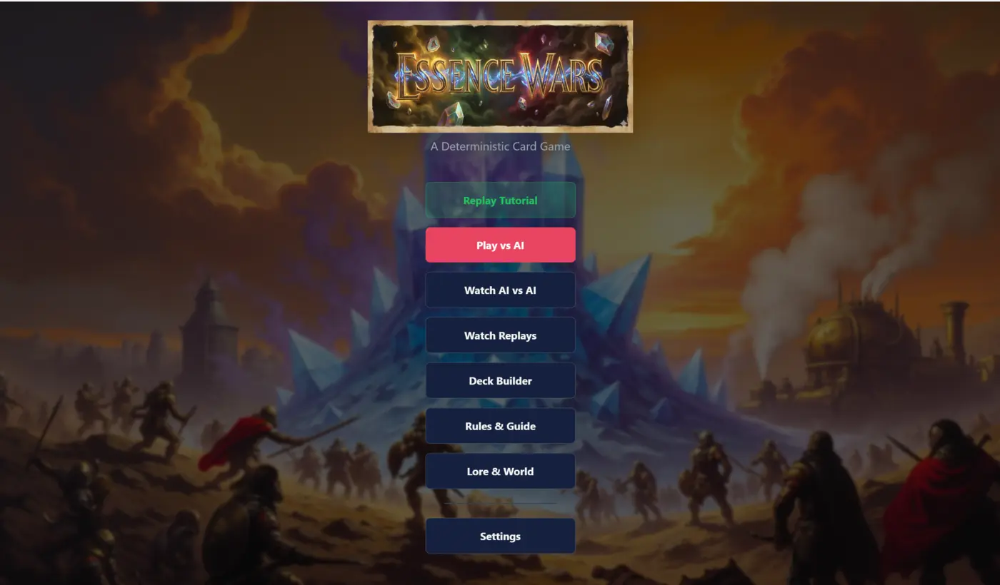
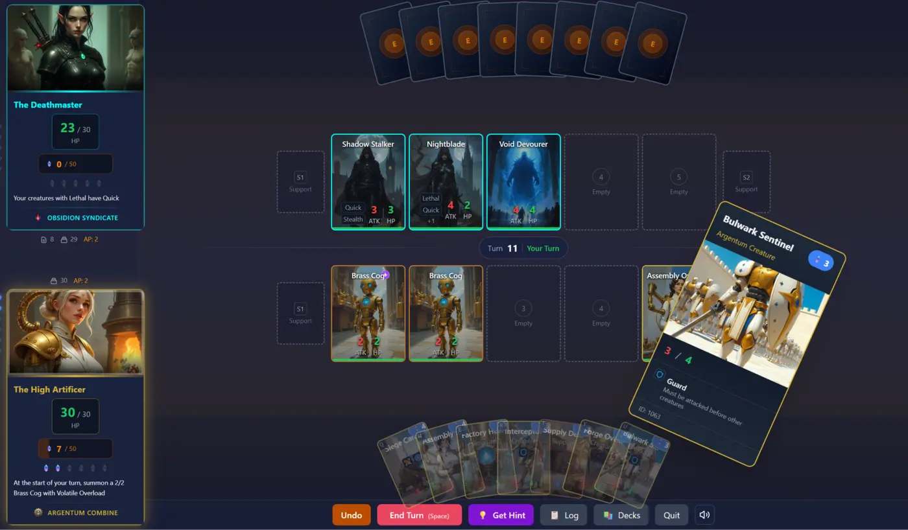
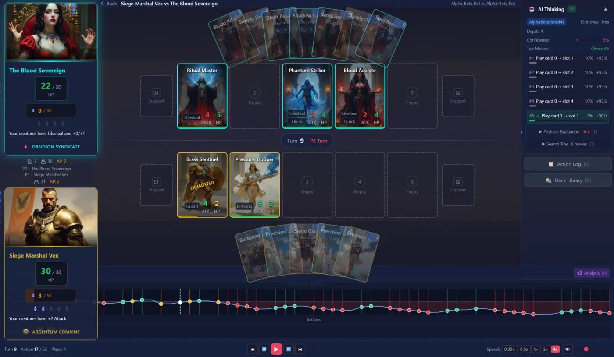
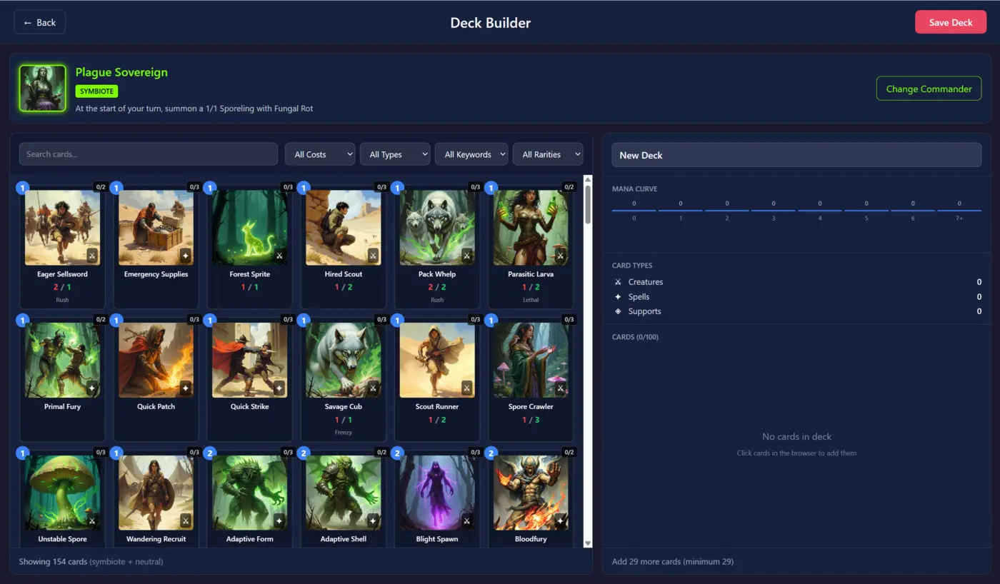

# Essence Wars - Desktop Application

Cross-platform desktop client for playing Essence Wars, built with Tauri 2 and Svelte 5.

## Overview

This application provides:

- **Human vs AI gameplay** with multiple difficulty levels
- **AI vs AI spectator mode** with real-time analysis dashboards
- **Replay system** for reviewing past matches
- **Deck builder** with validation and playstyle analysis
- **Interactive tutorial** for learning the game
- **Rich audio** with faction-themed music and sound effects
- **MCP integration** for Claude Code live game sync

## Screenshots

<p align="center">
  
  
</p>

<p align="center">
  
  
</p>

## Installation

### Prerequisites

- **Rust** 1.75+ (for Tauri backend)
- **Node.js** 20+ with **pnpm**
- **System dependencies** (Linux): `webkit2gtk-4.1`, `libayatana-appindicator3`

### Development

```bash
# Install frontend dependencies
pnpm install

# Start development server with hot reload
pnpm tauri:dev

# Type checking
pnpm run check

# Linting
pnpm run lint
```

### Building

```bash
# Linux (creates .deb, .rpm, .AppImage)
pnpm tauri:build

# Windows (from WSL2)
./scripts/build-windows.sh           # Unsigned
./scripts/build-windows.sh --sign    # Signed
```

## Tech Stack

| Layer | Technology |
|-------|------------|
| **Framework** | Tauri 2 (Rust backend + webview) |
| **Frontend** | Svelte 5 with runes-based reactivity |
| **Routing** | SvelteKit 2 |
| **Styling** | Tailwind CSS v4 |
| **Language** | TypeScript 5.6 |
| **Build** | Vite 6 |
| **Game Engine** | cardgame crate (shared) |

## Game Modes

### Human vs AI

Play against AI opponents with configurable difficulty:

- **Greedy Bot** - Fast heuristic evaluation (easy)
- **Alpha-Beta** - Minimax search, depth 4-8 (medium-hard)
- **MCTS** - Monte Carlo search, 100-1000 sims (hard)

**Features:**
- 3-step deck selection wizard
- Real-time AI hints (press `H` or click "Get Hint")
- Full action log with timestamps
- Undo support in development mode

### AI vs AI Spectator

Watch two AIs battle with full analysis:

- **Timeline scrubber** - Navigate to any game state
- **Evaluation graph** - Position score over time
- **Search tree visualization** - See AI decision process
- **Move probability heatmap** - Attention visualization

Toggle analysis mode with `A` key.

### Replay Viewer

Browse and replay saved matches:

- Frame-by-frame navigation
- Complete action history
- Match statistics comparison

### Deck Builder

Create custom decks with:

- Card browser with faction/cost/type filters
- Real-time deck validation (30 cards + commander)
- Mana curve visualization
- Playstyle analysis (Aggressive, Control, Tempo, etc.)
- Import/export to TOML format

### Tutorial

Interactive guided introduction covering:

- Basic mechanics (essence, action points)
- Card types and keywords
- Combat resolution
- Commander abilities

## Keyboard Shortcuts

| Key | Action |
|-----|--------|
| `Space` | End turn |
| `Escape` | Clear selection |
| `H` | Request AI hint |
| `I` | Use Commander's Insight |
| `D` | Toggle deck library |
| `A` | Toggle analysis mode (spectator) |
| `Q-U` | Select hand cards 0-6 |
| `1-5` | Select creature slots |
| `?` | Show help |

## Architecture

### Frontend Structure

```
src/
├── routes/                    # SvelteKit pages
│   └── +page.svelte          # Main app (state machine)
├── lib/
│   ├── components/
│   │   ├── board/            # Gameplay components
│   │   │   ├── GameBoard.svelte
│   │   │   ├── BattlefieldRow.svelte
│   │   │   ├── CommanderCardLarge.svelte
│   │   │   └── FanningHand.svelte
│   │   ├── menu/             # Setup & wizard
│   │   │   └── DeckSelectionWizard.svelte
│   │   ├── spectator/        # Analysis dashboard
│   │   │   ├── AnalysisDashboard.svelte
│   │   │   └── EvalTimeline.svelte
│   │   └── deckbuilder/      # Deck creation
│   ├── stores/               # Svelte 5 rune-based state
│   │   ├── gameState.svelte.ts
│   │   ├── spectatorState.svelte.ts
│   │   └── deckBuilderState.svelte.ts
│   ├── api/                  # Backend communication
│   │   ├── types.ts          # TypeScript DTOs
│   │   └── backends/tauri.ts # Tauri IPC wrapper
│   └── audio/                # Sound system
│       ├── manager.ts        # SFX with faction variants
│       └── music.ts          # Background music
└── app.css                   # Global styles, faction colors
```

### Tauri Backend

```
src-tauri/
├── src/
│   ├── commands/             # IPC endpoints
│   │   ├── game.rs          # Game control
│   │   ├── spectator.rs     # AI vs AI computation
│   │   ├── replay.rs        # Save/load replays
│   │   └── deck_builder.rs  # Custom deck management
│   ├── state/               # State managers
│   │   ├── game_manager.rs  # Active game sessions
│   │   └── serialization.rs # DTO conversions
│   ├── ai/                  # AI introspection
│   │   └── introspection.rs # Decision visualization
│   └── lib.rs               # Tauri setup
└── Cargo.toml
```

## Svelte 5 Runes

This project uses **Svelte 5 runes** (not Svelte 4 stores):

```svelte
<script>
  // Reactive state
  let count = $state(0);
  let doubled = $derived(count * 2);

  // Side effects
  $effect(() => {
    console.log(`Count is ${count}`);
  });
</script>
```

**Important:** `SvelteSet` and `SvelteMap` are already reactive - don't wrap in `$state()`:

```svelte
<script>
  import { SvelteSet } from 'svelte/reactivity';

  // Correct
  const items = new SvelteSet(['a', 'b']);

  // Wrong - unnecessary wrapper
  let items = $state(new SvelteSet(['a', 'b']));
</script>
```

## Faction Theming

Colors defined in `src/app.css`:

| Faction | Primary | Accent |
|---------|---------|--------|
| Argentum | `#F5F5F5` | `#D4AF37` (gold) |
| Symbiote | `#1A472A` | `#7FFF00` (lime) |
| Obsidion | `#8B0000` | `#00FFFF` (cyan) |
| Neutral | `#8B4513` | `#B87333` (copper) |

## Audio System

### Sound Effects

Located in `static/sounds/`:

| Category | Sounds |
|----------|--------|
| UI | hover, click, select, menu |
| Cards | draw, play creature/spell/support |
| Combat | attack (light/medium/heavy), damage, death |
| Game | turn start, victory, defeat |

Multiple random variants per sound type, with faction-specific variants for combat.

### Music

Background tracks in `static/music/`:

- **Menu**: 4 ambient tracks
- **Battle**: 4 combat tracks
- **Spectator**: 4 analysis tracks
- **Stings**: Victory and defeat

## MCP Integration

The app can sync with the MCP server for Claude Code integration:

```bash
# Start the UI
./scripts/launch-ui.sh

# Health check
curl http://127.0.0.1:9999/health
```

When MCP syncs game state, the UI automatically displays the current position.

## Assets

```
static/
├── cards/core_set/    # Card artwork (1000+ .webp)
├── portrait/          # Commander portraits
├── backgrounds/       # Menu backgrounds
├── ui/               # UI elements (banner, icons)
├── sounds/           # Sound effects (24 .ogg)
└── music/            # Background music (14 .ogg)
```

## Configuration

### Tauri Config (`tauri.conf.json`)

- Window: 1600×900 (min 1024×700), maximized on launch
- Icons: 32px, 128px, 128px@2x, .icns, .ico
- Resources: Card definitions and deck data bundled

### Vite Config

- Dev port: 1420 (fixed)
- HMR: WebSocket fallback for remote dev
- Watch ignores `src-tauri/` (Tauri watches separately)

## Testing

```bash
# Type checking
pnpm run check
pnpm run check:watch  # Continuous

# Linting
pnpm run lint
```

## License

MIT License - see [LICENSE](../../LICENSE) for details.
